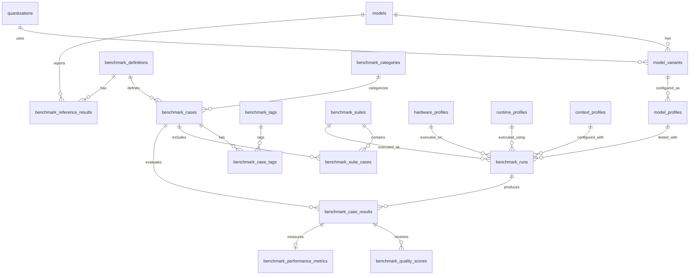

# Local AI Router — Benchmark Database Design v1

## 1. Purpose

The benchmark database provides durable relational storage for Local AI Router evaluation data.

It replaces temporary benchmark information that would otherwise exist only in:

- terminal output;
- loose JSON files;
- copied notes;
- isolated benchmark-tool reports.

The database must preserve enough information to answer both current and historical questions.

Examples include:

```text
Which model performed best on coding workloads?

How did qwen3.5-9b-32k perform last month compared with this month?

Did a new quantization improve speed while reducing answer quality?

Which model produced the best structured JSON reliability?

How much VRAM did each model require?

Did a router change cause a benchmark regression?

Which published benchmark result is directly comparable to our local result?
```

Historical results must never be silently overwritten.

---

## 2. Database organization

The initial PostgreSQL database will use a dedicated schema:

```text
benchmark
```

Future application data such as projects, conversations, messages, and memory may use a separate schema.

Conceptually:

```text
PostgreSQL database: local_ai_router

benchmark schema
    model evaluation
    benchmark definitions
    benchmark runs
    case results
    metrics
    hardware/runtime profiles

future application schema
    projects
    conversations
    messages
    memory
    retrieval
```

This gives the project logical separation without requiring multiple PostgreSQL servers or independent databases.

---

## 3. Design principles

The schema follows several rules.

Historical benchmark runs are immutable records.

Benchmark definitions and benchmark cases are versioned.

Model identity is separated from a particular quantized model artifact.

Model configuration is separated from model identity.

Hardware and runtime environments are recorded independently.

Quality metrics are stored separately from performance metrics.

Case-level results are preserved instead of storing only aggregate benchmark percentages.

Raw model responses are retained for later re-analysis.

Flexible JSONB metadata may supplement the relational schema, but important searchable fields must remain normal relational columns.

Primary and foreign keys are explicit.

---

## 4. Entity relationship diagram



---

# 5. Model tables

## 5.1 `models`

Represents the conceptual model rather than one downloaded artifact.

Example:

```text
Qwen 3.5 9B
```

Suggested columns:

| Column | Type | Purpose |
| --- | --- | --- |
| `model_id` | BIGINT PK | Internal database identifier |
| `model_name` | VARCHAR | Canonical model name |
| `model_family` | VARCHAR | Model family |
| `parameter_count_billion` | NUMERIC | Approximate parameter count |
| `publisher` | VARCHAR | Model publisher |
| `license_name` | VARCHAR nullable | License where known |
| `source_url` | TEXT nullable | Canonical model source |
| `notes` | TEXT nullable | Additional information |
| `created_at` | TIMESTAMPTZ | Record creation time |

`model_name` should have an appropriate uniqueness constraint when combined with model/version identity.

---

## 5.2 `quantizations`

Stores normalized quantization definitions.

Examples:

```text
FP16
Q8_0
Q6_K
Q5_K_M
Q4_K_M
```

Suggested columns:

| Column | Type | Purpose |
| --- | --- | --- |
| `quantization_id` | BIGINT PK | Internal identifier |
| `quantization_name` | VARCHAR UNIQUE | Canonical quantization name |
| `bits_per_weight` | NUMERIC nullable | Approximate bit width |
| `description` | TEXT nullable | Additional detail |

Quantization is represented separately because multiple model variants may share the same quantization format.

---

## 5.3 `model_variants`

Represents a specific model artifact that can actually be loaded.

Examples might include different:

- versions;
- quantizations;
- model digests;
- backend representations.

Suggested columns:

| Column | Type | Purpose |
| --- | --- | --- |
| `model_variant_id` | BIGINT PK | Internal identifier |
| `model_id` | BIGINT FK → `models.model_id` | Parent model |
| `quantization_id` | BIGINT FK nullable → `quantizations.quantization_id` | Quantization |
| `model_version` | VARCHAR nullable | Published model version |
| `backend_model_name` | VARCHAR | Identifier used by inference backend |
| `model_digest` | VARCHAR nullable | Backend/hash identifier |
| `advertised_context_tokens` | INTEGER nullable | Published/configured capability |
| `artifact_size_bytes` | BIGINT nullable | Model artifact size |
| `source_url` | TEXT nullable | Artifact source |
| `created_at` | TIMESTAMPTZ | Record creation time |

A digest or artifact identifier should be retained whenever the backend provides one.

This prevents two different model artifacts with similar display names from being treated as identical.

---

## 5.4 `model_profiles`

Represents an inference configuration applied to a model variant.

A model variant may therefore have several benchmark profiles.

Examples:

```text
qwen-fast-deterministic
qwen-reasoning-deterministic
qwen-temperature-0.7
```

Suggested columns:

| Column | Type | Purpose |
| --- | --- | --- |
| `model_profile_id` | BIGINT PK | Profile identifier |
| `model_variant_id` | BIGINT FK → `model_variants.model_variant_id` | Model artifact |
| `profile_name` | VARCHAR | Human-readable profile |
| `temperature` | NUMERIC nullable | Sampling temperature |
| `top_p` | NUMERIC nullable | Sampling configuration |
| `seed` | BIGINT nullable | Deterministic seed where supported |
| `max_output_tokens` | INTEGER nullable | Generation limit |
| `reasoning_enabled` | BOOLEAN nullable | Requested reasoning state |
| `reasoning_effort` | NUMERIC nullable | Future normalized effort |
| `backend_options` | JSONB nullable | Backend-specific settings |
| `created_at` | TIMESTAMPTZ | Creation time |

Core configuration values should use dedicated columns.

`backend_options` exists only for settings that do not justify permanent first-class columns.

---

# 6. Benchmark-definition tables

## 6.1 `benchmark_definitions`

Represents the originating benchmark dataset.

Examples:

```text
MMLU-Pro
GPQA Diamond
IFEval
HumanEval+
MBPP+
Local AI Router
```

Suggested columns:

| Column | Type | Purpose |
| --- | --- | --- |
| `benchmark_definition_id` | BIGINT PK | Internal identifier |
| `benchmark_name` | VARCHAR | Benchmark name |
| `benchmark_version` | VARCHAR | Dataset/version identifier |
| `source_url` | TEXT nullable | Upstream source |
| `evaluation_harness` | VARCHAR nullable | Evaluator used |
| `harness_version` | VARCHAR nullable | Evaluator version |
| `license_name` | VARCHAR nullable | Dataset license |
| `description` | TEXT nullable | Benchmark description |
| `created_at` | TIMESTAMPTZ | Record creation |

The combination of benchmark name and version should be unique.

---

## 6.2 `benchmark_categories`

Stores the primary capability categories established in Issue #7.

Examples:

```text
coding
debugging
architecture
database
project_context
routing
reasoning
instruction_following
structured_output
```

Suggested columns:

| Column | Type | Purpose |
| --- | --- | --- |
| `benchmark_category_id` | BIGINT PK | Internal identifier |
| `category_name` | VARCHAR UNIQUE | Canonical category |
| `description` | TEXT nullable | Meaning of category |

Categories should be data rather than hard-coded PostgreSQL enum values because the benchmark taxonomy will continue to evolve.

---

## 6.3 `benchmark_cases`

Represents a specific version of one benchmark question or task.

Suggested columns:

| Column | Type | Purpose |
| --- | --- | --- |
| `benchmark_case_id` | BIGINT PK | Internal identifier |
| `benchmark_definition_id` | BIGINT FK | Source benchmark |
| `benchmark_category_id` | BIGINT FK | Primary category |
| `external_case_id` | VARCHAR | Stable source/business identifier |
| `case_version` | INTEGER | Case version |
| `evaluation_target` | VARCHAR | `model` or `router` |
| `prompt_text` | TEXT | Exact prompt |
| `context_fixture` | VARCHAR nullable | Associated fixture |
| `scoring_method` | VARCHAR | Scoring method |
| `expected_answer` | TEXT nullable | Expected exact answer |
| `expected_route_mode` | VARCHAR nullable | Expected router result |
| `expected_criteria` | JSONB nullable | Rubric criteria |
| `critical` | BOOLEAN | Critical regression flag |
| `source_metadata` | JSONB nullable | Benchmark-specific metadata |
| `created_at` | TIMESTAMPTZ | Creation time |

A unique constraint should protect:

```text
benchmark_definition_id
external_case_id
case_version
```

A materially changed prompt should create a new `case_version`.

Historical case definitions should not be edited in place after benchmark results reference them.

---

# 7. Tags

## 7.1 `benchmark_tags`

Stores reusable tags such as:

```text
python
fastapi
postgresql
retrieval
long_context
async
reasoning
```

Columns:

| Column | Type |
| --- | --- |
| `benchmark_tag_id` | BIGINT PK |
| `tag_name` | VARCHAR UNIQUE |

---

## 7.2 `benchmark_case_tags`

Many-to-many association between benchmark cases and tags.

Columns:

| Column | Type |
| --- | --- |
| `benchmark_case_id` | BIGINT PK/FK |
| `benchmark_tag_id` | BIGINT PK/FK |

The composite primary key prevents duplicate case/tag assignments.

---

# 8. Benchmark suites

## 8.1 `benchmark_suites`

A benchmark definition represents where cases originate.

A benchmark suite represents a collection of cases we choose to run together.

Examples:

```text
local_ai_router_v1

development_standardized_v1

coding_periodic_v1

full_periodic_v1
```

Suggested columns:

| Column | Type |
| --- | --- |
| `benchmark_suite_id` | BIGINT PK |
| `suite_name` | VARCHAR |
| `suite_version` | INTEGER |
| `description` | TEXT nullable |
| `created_at` | TIMESTAMPTZ |

The combination of suite name and version should be unique.

---

## 8.2 `benchmark_suite_cases`

Many-to-many association between suites and cases.

Columns:

| Column | Type |
| --- | --- |
| `benchmark_suite_id` | BIGINT PK/FK |
| `benchmark_case_id` | BIGINT PK/FK |
| `execution_order` | INTEGER nullable |
| `weight` | NUMERIC nullable |

This design allows one benchmark case to participate in several suites without duplicating its definition.

---

# 9. Environment profiles

## 9.1 `hardware_profiles`

Represents physical benchmark hardware.

Suggested columns:

| Column | Type |
| --- | --- |
| `hardware_profile_id` | BIGINT PK |
| `profile_name` | VARCHAR UNIQUE |
| `cpu_model` | VARCHAR nullable |
| `system_ram_bytes` | BIGINT nullable |
| `gpu_model` | VARCHAR nullable |
| `gpu_count` | INTEGER |
| `vram_per_gpu_bytes` | BIGINT nullable |
| `notes` | TEXT nullable |
| `created_at` | TIMESTAMPTZ |

The initial profile will describe the RTX 5060 Ti 16 GB development workstation.

Software such as drivers and CUDA should not be stored here because those can change without changing the physical hardware.

---

## 9.2 `runtime_profiles`

Represents the software environment used for inference.

Suggested columns:

| Column | Type |
| --- | --- |
| `runtime_profile_id` | BIGINT PK |
| `profile_name` | VARCHAR |
| `operating_system` | VARCHAR nullable |
| `operating_system_version` | VARCHAR nullable |
| `kernel_version` | VARCHAR nullable |
| `python_version` | VARCHAR nullable |
| `nvidia_driver_version` | VARCHAR nullable |
| `cuda_version` | VARCHAR nullable |
| `backend_name` | VARCHAR |
| `backend_version` | VARCHAR nullable |
| `created_at` | TIMESTAMPTZ |

The router Git commit should remain run-specific rather than part of this profile.

---

## 9.3 `context_profiles`

Represents how context was supplied to the model.

Suggested columns:

| Column | Type |
| --- | --- |
| `context_profile_id` | BIGINT PK |
| `profile_name` | VARCHAR |
| `configured_context_tokens` | INTEGER nullable |
| `context_strategy` | VARCHAR | Example: `direct`, `retrieval` |
| `retrieval_enabled` | BOOLEAN |
| `retrieval_top_k` | INTEGER nullable |
| `chunk_size_tokens` | INTEGER nullable |
| `chunk_overlap_tokens` | INTEGER nullable |
| `additional_options` | JSONB nullable |
| `created_at` | TIMESTAMPTZ |

Actual prompt token usage belongs in individual result metrics because it can vary from case to case.

---

# 10. Benchmark execution

## 10.1 `benchmark_runs`

Represents one execution of a benchmark suite against a specific controlled environment.

Suggested columns:

| Column | Type |
| --- | --- |
| `benchmark_run_id` | BIGINT PK |
| `benchmark_suite_id` | BIGINT FK |
| `model_profile_id` | BIGINT FK |
| `hardware_profile_id` | BIGINT FK |
| `runtime_profile_id` | BIGINT FK |
| `context_profile_id` | BIGINT FK nullable |
| `router_git_commit` | VARCHAR nullable |
| `run_mode` | VARCHAR | Example: `warm`, `cold` |
| `status` | VARCHAR | Example: running/completed/failed |
| `started_at` | TIMESTAMPTZ |
| `completed_at` | TIMESTAMPTZ nullable |
| `notes` | TEXT nullable |

Each execution creates a new row.

A rerun never overwrites the previous run.

This is the foundation for historical comparison.

---

## 10.2 `benchmark_case_results`

Represents the result of one benchmark case during one run.

Suggested columns:

| Column | Type |
| --- | --- |
| `benchmark_case_result_id` | BIGINT PK |
| `benchmark_run_id` | BIGINT FK |
| `benchmark_case_id` | BIGINT FK |
| `result_status` | VARCHAR | passed/failed/error/not_eligible |
| `raw_model_response` | TEXT nullable |
| `normalized_quality_score` | NUMERIC nullable |
| `passed` | BOOLEAN nullable |
| `diagnostic_text` | TEXT nullable |
| `error_type` | VARCHAR nullable |
| `error_message` | TEXT nullable |
| `started_at` | TIMESTAMPTZ nullable |
| `completed_at` | TIMESTAMPTZ nullable |

A unique constraint should protect:

```text
benchmark_run_id
benchmark_case_id
```

for the first version of the runner.

If repeated trials are introduced later, a `trial_number` column can be added and incorporated into the uniqueness constraint.

---

# 11. Quality scoring

## 11.1 `benchmark_quality_scores`

Stores the detailed scoring behind a case result.

This is especially important for rubric-scored cases.

Suggested columns:

| Column | Type |
| --- | --- |
| `benchmark_quality_score_id` | BIGINT PK |
| `benchmark_case_result_id` | BIGINT FK |
| `criterion_name` | VARCHAR |
| `raw_score` | NUMERIC nullable |
| `max_score` | NUMERIC nullable |
| `normalized_score` | NUMERIC nullable |
| `passed` | BOOLEAN nullable |
| `scorer_type` | VARCHAR |
| `scorer_version` | VARCHAR nullable |
| `details` | JSONB nullable |

Example rubric result:

```text
Correct architecture:       4 / 4
Explains coupling:          3 / 4
Explains backend boundary:  4 / 4
Mentions extensibility:     3 / 4
```

The aggregate score may be stored on `benchmark_case_results`, but these component scores must remain available.

---

# 12. Performance metrics

## 12.1 `benchmark_performance_metrics`

Stores performance telemetry separately from answer quality.

Suggested columns:

| Column | Type |
| --- | --- |
| `benchmark_case_result_id` | BIGINT PK/FK |
| `total_duration_ns` | BIGINT nullable |
| `time_to_first_token_ns` | BIGINT nullable |
| `model_load_duration_ns` | BIGINT nullable |
| `prompt_token_count` | INTEGER nullable |
| `prompt_eval_duration_ns` | BIGINT nullable |
| `prompt_tokens_per_second` | NUMERIC nullable |
| `output_token_count` | INTEGER nullable |
| `output_eval_duration_ns` | BIGINT nullable |
| `output_tokens_per_second` | NUMERIC nullable |
| `baseline_vram_bytes` | BIGINT nullable |
| `peak_vram_bytes` | BIGINT nullable |
| `peak_system_ram_bytes` | BIGINT nullable |
| `backend_metrics` | JSONB nullable |

The result ID is both the primary key and foreign key, establishing a one-to-zero-or-one relationship with a case result.

A metric that is unavailable should remain `NULL`.

Estimated values should not be substituted unless explicitly marked as estimated.

---

# 13. Published reference results

## 13.1 `benchmark_reference_results`

Stores externally published benchmark scores separately from locally measured results.

This supports comparisons such as:

```text
Published MMLU-Pro score
versus
our locally measured MMLU-Pro score
```

Suggested columns:

| Column | Type |
| --- | --- |
| `benchmark_reference_result_id` | BIGINT PK |
| `benchmark_definition_id` | BIGINT FK |
| `model_id` | BIGINT FK nullable |
| `reported_model_name` | VARCHAR |
| `metric_name` | VARCHAR |
| `metric_value` | NUMERIC |
| `source_url` | TEXT |
| `reported_configuration` | JSONB nullable |
| `directly_comparable` | BOOLEAN |
| `published_at` | TIMESTAMPTZ nullable |
| `recorded_at` | TIMESTAMPTZ |

Reference scores must never be stored as if they were locally measured benchmark runs.

---

# 14. Historical data policy

Benchmark history is append-oriented.

The following records should normally be treated as immutable once referenced by benchmark results:

```text
benchmark case versions
benchmark suite versions
model variants
completed benchmark runs
case results
quality scores
performance measurements
```

Corrections should normally create new versions or new runs rather than silently changing historical evidence.

Administrative corrections should be exceptional and auditable.

---

# 15. Deletion policy

Historical benchmark data should not use broad cascading deletion from parent entities.

For example, deleting a model record must not accidentally erase months of benchmark history.

Foreign keys involving historical result records should generally use restrictive behavior.

Cascade deletion is appropriate primarily for structural association rows such as:

```text
benchmark_case_tags
benchmark_suite_cases
```

Database implementation will explicitly define these policies.

---

# 16. PostgreSQL data types

Use PostgreSQL-native capabilities deliberately.

Recommended choices include:

```text
BIGINT / identity
    primary and foreign keys

TIMESTAMPTZ
    timestamps

NUMERIC
    quality scores and measured rates where precision matters

BOOLEAN
    binary conditions

TEXT
    prompts, responses, diagnostics

JSONB
    flexible secondary metadata
```

JSONB must not become a replacement for relational modeling.

Fields commonly filtered, joined, sorted, or displayed in reports should receive dedicated columns.

---

# 17. Index strategy

Indexes will initially focus on historical/reporting queries.

Expected indexes include those supporting:

```text
benchmark runs by model and date

benchmark runs by suite and date

case results by run

case results by benchmark case

model variants by model

suite membership

benchmark category filtering

benchmark tag filtering
```

Indexes should be added based on actual query patterns rather than indexing every column preemptively.

---

# 18. Aggregate reporting

Version 1 should not store redundant benchmark averages unless necessary.

Values such as:

```text
average category quality score

average output tokens/sec

pass percentage

average latency
```

can initially be calculated from case-level records.

Later, PostgreSQL views or materialized views may provide dashboard-friendly aggregations.

This preserves the case-level records as the authoritative source.

---

# 19. Migration strategy

Database schema changes will be managed with Alembic.

The initial migration sequence will begin with a baseline migration creating the `benchmark` schema and benchmark tables.

Future schema changes must create additional migrations.

Existing migrations must not be rewritten after they have become part of shared project history.

Conceptually:

```text
migration 0001
    create benchmark schema and initial tables

migration 0002
    future schema change

migration 0003
    future schema change
```

The migration history therefore becomes version-controlled documentation of database evolution.

---

# 20. Seed-data strategy

Database migrations define database structure.

Seed scripts define development/reference data.

The project should not place the evolving benchmark dataset directly inside schema migrations.

Initial seed data will eventually include:

```text
benchmark categories

benchmark tags

Local AI Router benchmark definition

Local AI Router v1 cases

benchmark suite membership

initial hardware profile

initial runtime profile

initial model/model-variant records
```

A dedicated seed command or Python script should be idempotent where practical.

Running it more than once should not create duplicate reference records.

---

# 21. Test database strategy

Database tests should use a dedicated test database rather than the development benchmark database.

Conceptually:

```text
local_ai_router
    development database

local_ai_router_test
    automated integration-test database
```

Tests involving PostgreSQL should be isolated from real historical benchmark records.

CI database testing can later start a temporary PostgreSQL service.

Normal unit tests that do not require persistence should remain database-independent.

---

# 22. Future dashboard support

The schema is designed to support queries such as:

```text
latest benchmark run for each model

quality history for one model

coding performance by model

quality versus tokens/sec

quality versus VRAM

current result versus previous result

current result versus published reference result

context-size degradation

routing accuracy over time
```

These requirements influence the relational design now even though the frontend dashboard will be implemented later.

---

# 23. Initial technology stack

The benchmark persistence layer will use:

```text
PostgreSQL
SQLAlchemy 2.x
Psycopg 3
Alembic
```

SQLAlchemy will provide the Python ORM/data-access foundation.

Psycopg will provide PostgreSQL connectivity.

Alembic will provide version-controlled database migrations.

DBeaver may be used for manual database inspection and administration but is not part of application runtime behavior.

---

# 24. Application architecture boundary

Database models will remain separate from:

```text
FastAPI/Pydantic schemas

routing domain contracts

benchmark dataset JSON definitions
```

The architecture should therefore eventually resemble:

```text
Benchmark dataset definitions
        ↓
Benchmark runner
        ↓
Benchmark domain/data objects
        ↓
Repository/data-access layer
        ↓
SQLAlchemy persistence models
        ↓
PostgreSQL
```

HTTP request schemas, routing objects, and database persistence classes should not become one shared class hierarchy.

Each layer has a distinct responsibility.

---

# 25. Version-1 schema objective

The initial database implementation should be sufficient to:

1. Register a model and specific model variant.
2. Register a benchmark suite and its cases.
3. Record the exact model, hardware, runtime, and context configuration used by a benchmark run.
4. Create a durable benchmark run identifier.
5. Store each individual case result.
6. Preserve raw model responses.
7. Store criterion-level quality measurements.
8. Store timing, token, VRAM, and RAM measurements.
9. Query historical results without overwriting earlier runs.
10. Compare locally measured results with published reference scores.

This is the minimum persistence foundation required before the automated benchmark runner in Issue #9 is implemented.